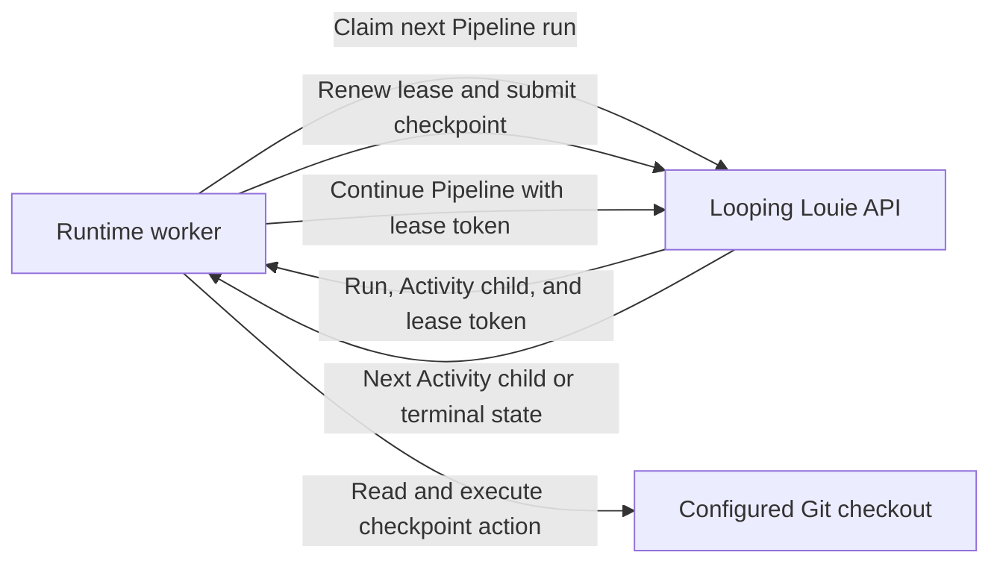

# Looping Louie Runtime Architecture

Looping Louie Runtime is a local worker for Pipeline execution. It claims
queued work from the Looping Louie API, executes API-directed local checkpoints
in configured Git checkouts, and returns checkpoint results to the API.

The runtime has no persistent database and does not make model, reviewer, or
scheduling decisions. The API is the durable control plane. A runtime process
is the local execution plane for the workspaces in its configuration.

## System Boundary

The runtime owns:

- Mapping workspace IDs to explicitly configured local Git checkouts.
- Inspecting repository state and collecting bounded context.
- Applying validated filesystem operations.
- Evaluating the local Git commit policy and creating allowed commits.
- Polling, claiming, lease renewal, and checkpoint submission through the API.

The API owns:

- Pipeline definitions, runs, step scheduling, and durable state.
- Activity-run state, continuation tokens, and idempotency records.
- Model generation, reviewer decisions, and planned file operations.
- Lease issuance and stale-worker fencing.

The runtime never accepts a checkout path from an API response. It selects a
checkout only through its local workspace mapping.

## Execution Flow



The worker polls at most one run per configured workspace per cycle. A
`RuntimeError` in one workspace is logged without preventing other workspaces
from being polled. The runner retries operational failures after the configured
delay. Unexpected errors stop the process.

## Source Structure

Runtime source modules are grouped by ownership. Composition, polling, and
checkpoint orchestration remain directly under `src`, while HTTP adapters and
local Git operations have dedicated packages.

```text
src/
|-- main.py                Builds configured clients, worker, and polling loop
|-- config.py              Parses local configuration and validates checkouts
|-- worker.py              Polls workspace queues and isolates workspace errors
|-- runner.py              Repeats bounded poll cycles with operational retry
|-- clients/
|   |-- pipeline_client.py
|   |                       Claims, renews, and advances Pipeline runs over HTTP
|   `-- activity_client.py Reads and checkpoints Activity runs over HTTP
|-- executor.py            Coordinates local checkpoint execution for a claim
|-- services/
|   `-- git/
|       |-- repository_context.py  Inspects Git state and builds bounded context
|       |-- file_operations.py     Validates and atomically applies planned writes
|       `-- policy.py              Parses and evaluates local Git commit policy
`-- doc/arquitecture.md    Documents runtime ownership and execution boundaries
```

Tests follow the same ownership boundaries. Cross-boundary orchestration tests
remain directly under `tests`.

```text
tests/
|-- clients/
|   |-- test_pipeline_client.py
|   `-- test_activity_client.py
|-- services/
|   `-- git/
|       `-- test_repository_context.py
|-- test_config.py
|-- test_executor.py
|-- test_runner.py
`-- test_worker.py
```

### Composition

`main.py` is the composition root. It loads and validates `RuntimeConfig`,
creates the two HTTP clients, passes them to `ActivityExecutor`, and constructs
`RuntimeWorker` with the executor callback. It then invokes `run_forever`.

Dependency flow is:

```text
main -> config, clients, executor, worker, runner
worker -> ClaimClient, executor callback
executor -> activity client, pipeline client, services.git
clients -> HTTP API
services.git -> configured Git checkout
```

The worker and executor depend on protocols rather than concrete HTTP clients.
Tests use those protocols to isolate polling and checkpoint behavior from HTTP.

## Checkpoint Execution

`ActivityExecutor` processes the API-selected child until its Activity status
is terminal. It supports these local actions:

### `collect_snapshot`

Build repository context, project profile, and constitution. Return snapshot
data and the source commit SHA to the API.

### `apply_operations`

Validate and apply planned create, replace, replace-text, and delete
operations. Return the application outcome, diff, and changed files.

### `submit_review_input`

Read the final diff and bounded changed-file contents. Return the review input.

### `commit_if_allowed`

Apply the pre-execution local policy and commit eligible changes. Return the
commit outcome, SHA, or denial reason.

The executor validates Activity and Pipeline response fields that control local
progress. Malformed responses stop the affected workspace rather than causing
an implicit checkpoint or Pipeline completion.

## Local State and Git Boundaries

The runtime stores no run state locally. API Pipeline and Activity runs are the
source of truth for progress, retry tokens, and scheduling.

The configured checkout is the local side-effect boundary. Before the worker
starts, every checkout must be a clean Git repository. During execution:

- Repository context reads do not stage untracked files or modify the Git index.
**File operations.** Operations reject traversal, symbolic links, invalid
paths, and invalid operation shapes before writing files.

**Commit policy.** Local `louie.yaml` policy is loaded before planned
operations begin. That captured policy governs all commit checkpoints for the
claimed Pipeline run.

**Commit decision.** `commit_if_allowed` does not commit when policy, branch
protection, commit metadata, or repository state blocks the action.

## Lease and Failure Boundaries

A successful claim includes a secret lease token. The executor renews that
lease before every Activity checkpoint and before Pipeline continuation. It
also submits the Pipeline run ID and lease token with every Activity checkpoint.

The API validates lease ownership before generation and again atomically when
it persists an Activity or Pipeline transition. A runtime whose lease has
expired, or whose claim has been replaced, cannot advance durable state.

Operational HTTP, Git, validation, and checkpoint failures are normalized as
`RuntimeError`. The worker records the workspace failure and continues polling
other configured workspaces. The long-running runner retries another cycle
after `poll_interval_seconds`.

## Architectural Inspection Points

Future architecture reviews can use these boundaries to locate responsibility
drift:

**Composition.** `main.py` remains wiring only; it does not acquire execution
rules.

**Polling.** `worker.py` remains responsible for workspace polling and error
isolation, not checkpoint behavior.

**Checkpoint orchestration.** `executor.py` remains the orchestration point for
the local half of the checkpoint protocol.

**Local Git services.** The `services.git` package owns repository context,
file operations, and commit policy without HTTP or scheduling concerns.

**HTTP clients.** The `clients` package contains transport adapters and does
not perform filesystem or Git operations.

**New actions.** New Activity action types require an explicit executor action
handler and a corresponding API checkpoint contract.

**Persistence.** New local persistence requires an ownership decision because
the API is currently the sole durable execution-state authority.
