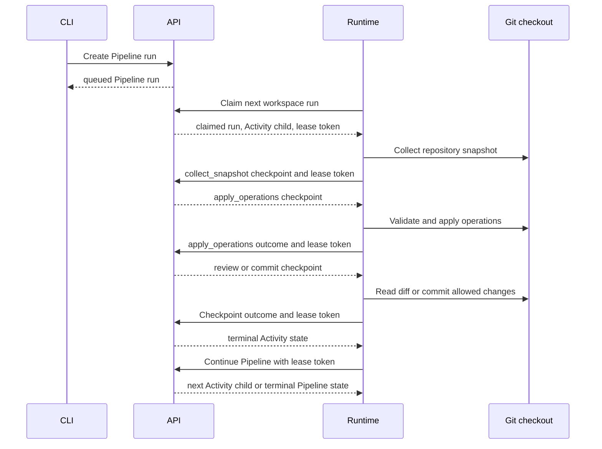

# Pipeline Execution Lifecycle

Looping Louie executes Pipeline work through three cooperating components:

- The CLI creates and inspects API resources.
- The API owns all durable Pipeline and Activity state.
- The runtime polls for API-assigned work and performs local checkout actions.

The runtime never mutates durable run status directly. It submits checkpoint
outcomes under an active lease. The API validates those outcomes and persists
the resulting Activity and Pipeline transitions.

## Ownership

### CLI

The CLI is an API client. It creates Pipeline runs and provides operators with
resource-management commands. It does not execute Pipeline steps or select a
local checkout.

### API

The API is the control plane and source of truth for:

- Pipeline definitions, Activity definitions, and their immutable run snapshots.
- Pipeline-run, step, and Activity-run status.
- Queue ordering, claim leases, continuation tokens, and idempotency records.
- Model generation, reviewer decisions, and planned file operations.
- Terminal failure reasons and cancellation decisions.

Only the API persists a transition such as `queued -> claimed`,
`in_progress -> completed`, or `claimed -> failed`.

### Runtime

The runtime is the local execution plane. It maps an API workspace identifier
to a configured clean Git checkout, then performs the API-directed checkpoint
actions in that checkout. Its responsibilities are:

- Polling configured workspaces and claiming at most one run per workspace.
- Renewing the active Pipeline lease before every state-changing checkpoint.
- Collecting bounded repository context.
- Applying validated planned file operations.
- Supplying review input from the final local diff.
- Evaluating local Git policy and committing allowed changes.
- Reporting the outcome of each local checkpoint to the API.

The runtime must never choose a checkout from an API response or update a
Pipeline or Activity status in local storage.

## Normal Execution

The expected flow is:

1. CLI creates a Pipeline run in queued.
2. Runtime claims it. The API gives the worker a one-minute lease token and the
run becomes claimed.
3. Runtime collects local context and checkpoints it to the API.
4. API invokes the configured model to produce the planned operations.
5. Runtime applies approved operations and commits them.

The following diagram shows the usual single-Activity Pipeline flow.



### 1. Queue a Pipeline run

The CLI sends a Pipeline run request with the requested work as `input`.
The API creates a `queued` Pipeline run and captures the configured steps.

```text
CLI
  -> POST /pipelines/{pipeline_id}/runs
API
  -> Pipeline run status: queued
```

### 2. Claim work

The runtime polls each configured workspace. The API selects one claimable run
for that workspace, records a lease token and expiry, and returns the selected
Activity child.

```text
Runtime
  -> POST /pipelines/runs/claim
API
  -> Pipeline run status: claimed
  -> active lease token and expiry
  -> current Activity run status: in_progress
```

The lease fences stale workers. Every later runtime checkpoint and Pipeline
continuation includes the same Pipeline run identifier and lease token.

### 3. Submit checkpoint outcomes

The runtime reads the current Activity run and performs its requested action.
It submits the result with a continuation token, idempotency key, Pipeline run
identifier, and lease token. The API validates all of them before changing
durable state.

```text
Runtime
  -> POST /activities/{activity_id}/runs/{run_id}/continue
API
  -> validates workspace, Pipeline lease, continuation token, and idempotency
  -> persists next Activity state
  -> returns the next action or a terminal Activity state
```

### 4. Continue the Pipeline

After an Activity reaches a terminal state, the runtime requests Pipeline
scheduling continuation. The API records the step outcome, schedules the next
dependency-ready Activity, skips blocked branches, or makes the Pipeline run
terminal.

```text
Runtime
  -> POST /pipelines/{pipeline_id}/runs/{run_id}/continue
API
  -> records terminal child outcome
  -> returns next Activity child or terminal Pipeline state
```

## Success Outcomes

The runtime signals success by returning a valid checkpoint result. The API
then decides and persists the corresponding status transition.

### Snapshot and generation

```text
Runtime submits collect_snapshot result
  -> API keeps Activity in_progress
  -> API generates planned operations
  -> API returns apply_operations as the next action
```

### Apply operations

```text
Runtime applies planned file operations successfully
  -> runtime sends { action: apply_operations, applied: true, ... }
  -> API keeps Activity in_progress
  -> API requests review input or a commit checkpoint
```

### Review approval

```text
Runtime submits review input
  -> API obtains an approving review
  -> API keeps Activity in_progress
  -> API returns commit_if_allowed as the next action
```

### Commit

```text
Runtime commits allowed changes
  -> runtime sends { action: commit_if_allowed, committed: true, commit_sha: ... }
  -> API marks Activity completed

Runtime continues the Pipeline
  -> API records the step completed
  -> API schedules a next child or marks the Pipeline completed
```

## Failure Ownership

Failure ownership depends on where the failure occurs. The API always persists
the durable terminal transition, but either the API or the runtime may be the
component that detects the problem.

### Checkpoint outcomes known to the runtime

Some local outcomes are already represented by a normal checkpoint result. The
runtime reports the outcome, and the API marks the Activity failed.

```text
Runtime cannot safely apply planned file operations
  -> runtime sends { action: apply_operations, applied: false, error: ... }
  -> API marks Activity failed

Runtime cannot commit because policy denies it, no changes exist, or Git fails
  -> runtime sends { action: commit_if_allowed, committed: false, error: ... }
  -> API marks Activity failed
```

Once the Activity is terminal, the runtime continues the Pipeline. The API
records the child step as failed, applies dependency rules, and returns the next
child or a terminal Pipeline state.

### API-owned execution failures

The API must persist a terminal failure when it detects a non-retryable error
while processing a valid checkpoint. No additional runtime request is needed.

Examples include:

- A configured model is missing or disabled.
- A provider or linked service is misconfigured.
- Model generation returns a failure the API classifies as non-retryable.
- Activity configuration is invalid during API generation or review.
- A reviewer rejects the work after all configured retries are exhausted.

The required behavior is:

```text
Runtime submits a valid checkpoint under an active lease
  -> API starts API-owned generation, review, or validation work
  -> API detects a non-retryable failure
  -> API atomically marks the Activity and Pipeline step failed
  -> API records a structured failure reason
  -> API returns the terminal Activity representation or a classified error
```

If the final Activity step has failed, the API must make the Pipeline run
advanceable to a terminal failed state. A missing model must not leave the
Pipeline queued or reclaimable indefinitely.

### Runtime-owned execution failures

Some failures occur after a claim but outside API visibility. The API cannot
infer their cause merely from a lease expiring.

Examples include:

- A Git command fails locally.
- The configured checkout becomes inaccessible.
- An unexpected filesystem operation fails.
- The local `louie.yaml` policy cannot be read.
- The runtime receives a malformed API response after a request completes.
- The API cannot be reached before the runtime can submit a checkpoint result.

For locally detected failures that cannot be expressed by an existing action
outcome, the runtime needs a fenced failure-reporting API contract:

```text
Runtime detects a terminal local execution failure
  -> runtime reports failure type and safe reason with the active lease token
  -> API validates current lease ownership atomically
  -> API marks the current Activity and Pipeline step failed
  -> API records the structured failure reason
  -> API makes the Pipeline queue advanceable
```

This is not direct runtime status mutation. The API remains the sole durable
state owner and rejects reports from expired or superseded workers.

## Retry and Queue Safety

A lease is appropriate for transient worker loss or temporary transport
failure. When a worker disappears, lease expiry makes the run claimable again.

A non-retryable failure must instead become terminal. Otherwise an
oldest-first queue repeatedly reclaims the same invalid run and blocks every
later run in that workspace.

```text
Oldest queued or expired run is permanently invalid
  -> runtime claims it
  -> execution fails
  -> no durable failed transition
  -> lease expires
  -> scheduler selects the same oldest run again
  -> later valid runs remain blocked
```

This head-of-line blocking is prevented only when the owner that detects a
permanent failure causes the API to persist a terminal failure transition.

## Operator Cancellation

Cancellation is distinct from execution failure. Operators need a supported
CLI/API operation to cancel accidental, obsolete, or intentionally abandoned
Pipeline runs without modifying the database directly.

Cancellation should:

- Record that the terminal state was operator-initiated.
- Revoke or fence an active lease when cancellation races with a worker.
- Prevent further checkpoint or Pipeline continuation transitions for the run.
- Leave later queued runs claimable.

## Lifecycle Rules

The following rules preserve the control-plane boundary:

1. The API is the only component that persists Pipeline and Activity status.
2. The runtime submits lease-fenced checkpoint outcomes; it does not choose
   state transitions directly.
3. API-owned non-retryable errors must transition state atomically before the
   API returns control to the runtime.
4. Runtime-owned terminal errors need an API reporting contract that is fenced
   by the active lease.
5. Lease expiry retries abandoned work; it must not be the only response to a
   known permanent failure.
6. Every terminal Activity outcome must be recorded by Pipeline scheduling so
   later work can proceed or the Pipeline can become terminal.
