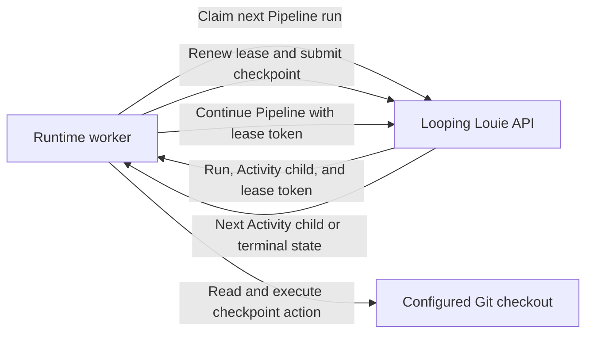

# Looping Louie Runtime Product Architecture

This temporary document describes the Looping Louie product architecture from
the runtime repository's perspective. It is not runtime software architecture.
The runtime repository's implementation architecture is documented in
[arquitecture.md](arquitecture.md).

Looping Louie coordinates iterative LLM-assisted software development. The API
persists Pipeline and Activity state while the runtime executes repository
changes in configured local Git checkouts.

The runtime is independent from any programming language, framework, or LLM
provider.

The runtime has no persistent database and does not make model, reviewer, or
scheduling decisions. The API is the durable control plane. A runtime process
is the local execution plane for the Projects in its configuration.

## System Boundary

The runtime owns:

- Mapping Project IDs to explicitly configured local Git checkouts.
- Propagating the configured User identity on every API request.
- Detecting local Harness capabilities and provisioning missing worker IDs.
- Inspecting repository state and collecting bounded context.
- Applying validated filesystem operations.
- Evaluating the local Git commit policy and creating allowed commits.
- Polling, claiming, lease renewal, and checkpoint submission through the API.

The API owns:

- Pipeline definitions, runs, step scheduling, and durable state.
- Activity-run state, continuation tokens, and idempotency records.
- Model generation, reviewer decisions, and planned file operations.
- Lease issuance and stale-worker fencing.

The runtime never accepts a checkout path from an API response. It selects a
checkout only through its local Project mapping.

## Worker Provisioning

The API provisions each Project worker identity under the authenticated User.
On initial provisioning, the runtime submits its locally detected Harnesses,
stores the assigned ID in its Project configuration, and reuses it on later
starts. It refreshes the worker heartbeat before polling. PipelineRun claims
require an active worker heartbeat, while the existing PipelineRun lease
continues to authorize only one claimed run. Heartbeat liveness never renews
or revokes a lease.

When a Project lacks a worker ID, the runtime detects whether the configured
Codex executable is installed and authenticated, and whether the configured
Copilot executable is available. It registers the worker once with the
detected Harness set and atomically persists the returned API ID in the runtime
JSON. The detector refreshes at most every 30 seconds, and each heartbeat
replaces the API's observed Harness set. The worker advertises local Harness
health only; it does not enumerate models accepted by either CLI.

## Ownership Boundaries

The API owns User and Project resource management, including User-owned
Activity and Pipeline definitions, Project membership, durable Pipeline and
Activity-run state, prompt generation, model decisions, and checkpoint
transitions. Pipeline and Activity definitions are independent of execution
placement; Pipeline and Activity runs remain Project-placed. The runtime owns
Project lifecycle, repository inspection, filesystem changes, Git operations,
and Activity execution after it claims a queued Pipeline run.

The API never mutates the target repository directly, and the runtime does not
make model or reviewer decisions. A claimed runtime worker must present its
active lease token before it checkpoints an Activity child or advances Pipeline
scheduling; the API rejects stale workers before either durable mutation.

## Execution Flow

The worker polls at most one run per configured project per cycle. The runtime
retries operational failures after the configured delay without preventing
other Projects from being polled. Unexpected errors stop the process.
