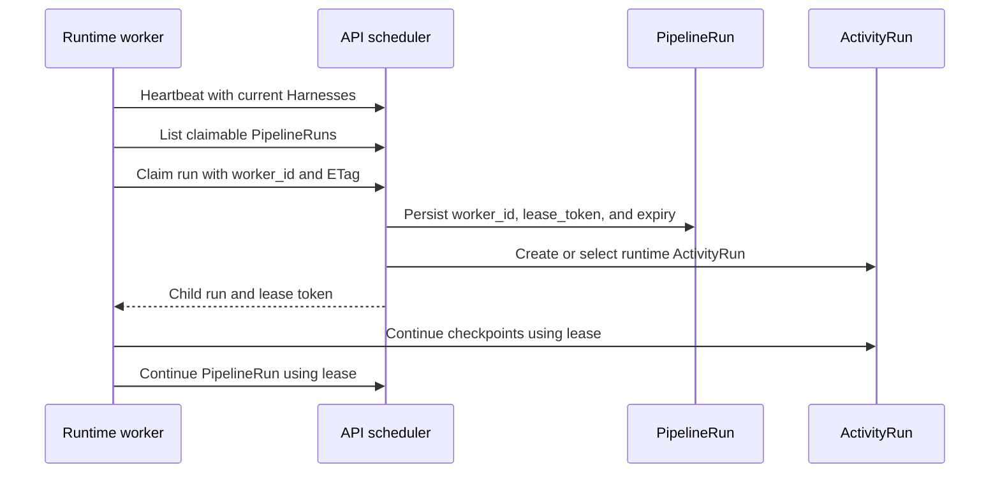
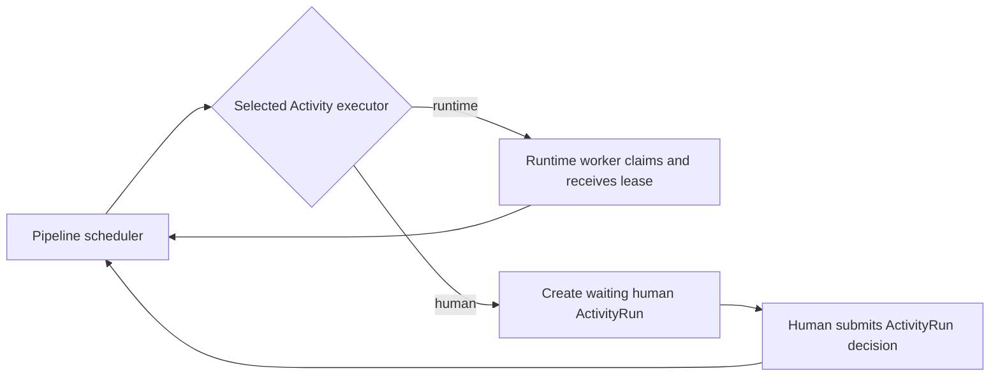

# Worker Overview

## Provisioning and heartbeat

The API provisions a `worker_id` for each configured project. The runtime
stores that identity in its project mapping and sends a heartbeat before each
project poll.
The API permits a PipelineRun claim only when that worker has sent a heartbeat
within the active heartbeat window and currently advertises the run's frozen
Harness.

Provisioning answers which durable worker identity may act in a project. A
heartbeat answers whether that identity is currently available. A
PipelineRun lease answers whether that worker may mutate one specific run.
They remain independent: a heartbeat does not extend a lease, and a lease
expires normally even when a worker stops heartbeating.

A worker is a specific running instance of `looping-louie-runtime`. It is not
a new kind of Pipeline, Activity, or ActivityRun.

That identity is `ProjectCheckout.worker_id`. The API persists a durable
project-scoped identity, recent heartbeat, and currently observed Harnesses for
it, then stores the ID on claimed `pipeline_runs`. Every heartbeat replaces the
capability set. The runtime always advertises `louie` and advertises
`codex_cli` only while the configured executable and local login check succeed.
It does not advertise models: model policy belongs to the API, while acceptance
by the authenticated Codex account is ultimately an execution-time CLI result.



The important distinction is:

- **Worker provisioning and heartbeat:** control-plane identity and liveness
  information about a runtime instance.
- **Pipeline-run lease:** short-lived, execution-plane permission for one
  PipelineRun.
- **ActivityRun:** the universal unit of work, executed by either `runtime` or
  `human`.

## Heartbeats And Leases

A heartbeat must not extend a Pipeline-run lease. They have different failure
semantics.

| Concern | Worker heartbeat | Pipeline-run lease |
| --- | --- | --- |
| Answers | Is this runtime instance currently available? | May this instance mutate this specific run? |
| Scope | Worker, likely per configured project | One PipelineRun |
| Expiry consequence | Stop admitting new claims to that worker | Another worker may reclaim the stalled run |
| Renewal | Before each project poll, with current Harnesses | Before execution-changing API calls |

## Pull-Based Claiming

The system uses pull-based scheduling. The API does not select a worker;
workers poll for available work and the API admits or rejects each atomic
claim.

```text
worker polls
  -> API lists work compatible with that active worker
  -> worker attempts ETag-protected claim
  -> API verifies:
      provisioned and heartbeat fresh
       heartbeat fresh
       authorized for project
       capable of the selected runtime Activity
  -> API issues the normal run lease
```

This preserves the current boundary: the runtime owns polling and local
execution, while the API remains the scheduler and source of truth.

## Capabilities

Capabilities describe current local Harness health, not every activity type or
model that might be accepted. The heartbeat declaration is:

```json
{
  "harnesses": [
    {"kind": "louie", "version": "v1", "config": {}},
    {"kind": "codex_cli", "version": "v1", "config": {}}
  ]
}
```

The API compares that declaration with the frozen selected Activity snapshot.
It must never treat `approval` or `quiz` as worker capabilities: they have an
`executor` of `human` and are not runtime work. A valid PipelineRun remains
queued while no active worker advertises its Harness. After, for example,
`codex login` succeeds, a later heartbeat adds `codex_cli` and normal polling
can claim the existing run without user intervention.

## Human ActivityRuns

A runtime currently can claim a queued Pipeline whose next step is human. The
API changes that Pipeline to `waiting`, returns the human child, and the runtime
client discards the response because it has no lease. The behavior is safe, but
it makes a worker perform scheduling work it cannot execute.

The cleaner target is for the scheduler to materialize a ready human child
without a runtime claim, such as at Pipeline creation or immediately after the
preceding child becomes terminal. Workers then never see human work as
claimable.



## Current Narrow Implementation

The worker provisions one identity per project, reports liveness and its two
supported Harness kinds, and leaves Pipeline-run leases unchanged. The
capability detector is shared across projects and cached for 30 seconds so a
poll cycle does not repeatedly spawn Codex probes. Human ActivityRuns remain
outside worker capabilities.
