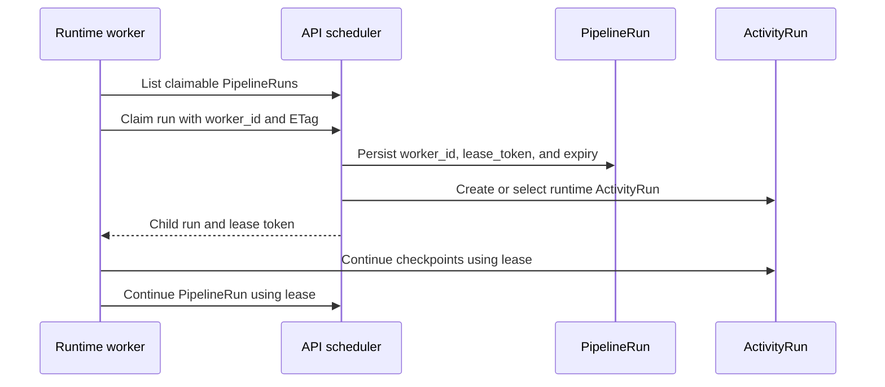
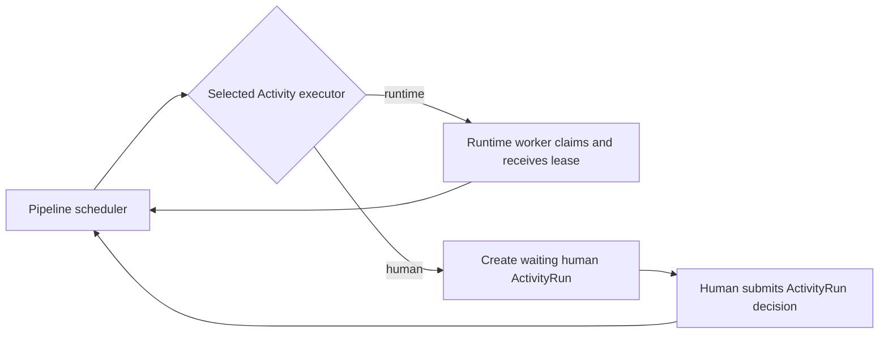

# Worker Overview

## Provisioning and heartbeat

The API provisions a `worker_id` for each configured workspace. The runtime
stores that identity in its workspace mapping and sends a heartbeat before each
workspace poll.
The API permits a PipelineRun claim only when that worker has sent a heartbeat
within the active heartbeat window.

Provisioning answers which durable worker identity may act in a workspace. A
heartbeat answers whether that identity is currently available. A
PipelineRun lease answers whether that worker may mutate one specific run.
They remain independent: a heartbeat does not extend a lease, and a lease
expires normally even when a worker stops heartbeating.

A worker is a specific running instance of `looping-louie-runtime`. It is not
a new kind of Pipeline, Activity, or ActivityRun.

That identity is `WorkspaceCheckout.worker_id`. The API persists a durable
workspace-scoped identity and recent heartbeat for it, then stores the ID on
claimed `pipeline_runs`. Capabilities remain intentionally deferred: this slice
does not claim that a registered worker can execute every possible future
Activity type.



The important distinction is:

- **Worker provisioning and heartbeat:** control-plane identity and liveness
  information about a runtime instance.
- **Pipeline-run lease:** short-lived, execution-plane permission for one
  PipelineRun.
- **ActivityRun:** the universal unit of work, executed by either `runtime` or
  `human`.

## Heartbeats And Leases

A heartbeat must not extend a Pipeline-run lease. They have different failure
semantics.

| Concern | Worker heartbeat | Pipeline-run lease |
| --- | --- | --- |
| Answers | Is this runtime instance currently available? | May this instance mutate this specific run? |
| Scope | Worker, likely per configured workspace | One PipelineRun |
| Expiry consequence | Stop admitting new claims to that worker | Another worker may reclaim the stalled run |
| Renewal | Periodic background heartbeat | Before execution-changing API calls |

## Pull-Based Claiming

The system uses pull-based scheduling. The API does not select a worker;
workers poll for available work and the API admits or rejects each atomic
claim.

```text
worker polls
  -> API lists work compatible with that active worker
  -> worker attempts ETag-protected claim
  -> API verifies:
      provisioned and heartbeat fresh
       heartbeat fresh
       authorized for workspace
       capable of the selected runtime Activity
  -> API issues the normal run lease
```

This preserves the current boundary: the runtime owns polling and local
execution, while the API remains the scheduler and source of truth.

## Capabilities

Capabilities matter only when different workers can actually execute different
runtime work. A conservative capability declaration could be:

```json
{
  "worker_id": "runtime-local-01",
  "workspaces": ["workspace-acme"],
  "activity_types": [
    "direct_loop",
    "refinement_loop",
    "roundtable_loop"
  ]
}
```

The API compares that declaration with the frozen selected Activity snapshot.
It must never treat `approval` or `quiz` as worker capabilities: they have an
`executor` of `human` and are not runtime work.

## Human ActivityRuns

A runtime currently can claim a queued Pipeline whose next step is human. The
API changes that Pipeline to `waiting`, returns the human child, and the runtime
client discards the response because it has no lease. The behavior is safe, but
it makes a worker perform scheduling work it cannot execute.

The cleaner target is for the scheduler to materialize a ready human child
without a runtime claim, such as at Pipeline creation or immediately after the
preceding child becomes terminal. Workers then never see human work as
claimable.



## Recommended First Step

All current runtime Activity types use the same runtime executable and
checkpoint protocol. The configured workspace mapping already constrains each
runtime to repositories it may execute. Provisioning and heartbeat therefore
provide useful liveness and observability, while capability filtering should
wait for a concrete routing requirement, such as different model-provider
access, platform tooling, network or credential boundaries, execution engines,
or workspace-specific worker pools.

The narrow first implementation is:

1. Provision one worker identity per workspace with a heartbeat timestamp.
2. Require an active heartbeat for a runtime claim.
3. Keep Pipeline-run leases unchanged.
4. Do not add capabilities until a real runtime difference requires them.
5. Schedule human ActivityRuns without a runtime claim.
